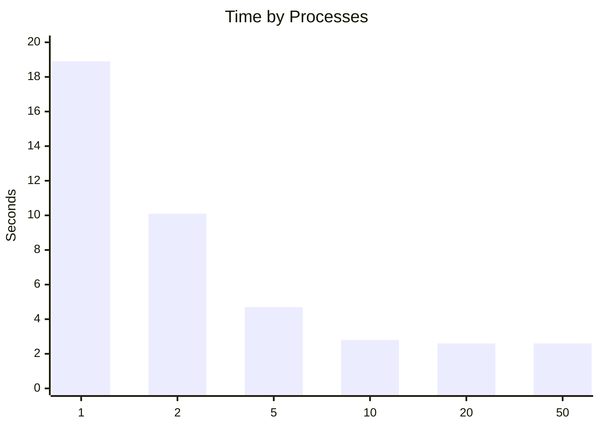

# System Programming Lab 11 Multiprocessing

- creates a semaphore that only allows the specified number of child processes
- spawns processes to creates and save each frame
- uses the semaphore to wait until all frames are created
- frees allocated memory

|threads v, processes >|1|2|5|10|20|
|-|-|-|-|-|-|
|1| 53.1 | 29.1 | 17.0 | 13.8 | 12.6 |
|2| 32.5 | 17.3 | 9.7 | 7.6 | 8.0 |
|5| 30.1 | 18.5 | 11.3 | 11.1 | 9.5 |
|10| 18.8 | 14.0 | 11.6 | 10.8 | 12.1 |
|20| 17.0 | 9.7 | 10.1 | 10.3 | 11.0 |

generally adding more processes makes the program run faster, although no sigificant improvents are made after 10 processes are created this may be because my computer has 12 cores so anything only 12 processes can run at a time any way