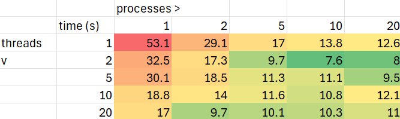

# System Programming Lab 11 Multiprocessing

- creates a semaphore that only allows the specified number of child processes
- spawns processes to creates and save each frame
- uses the semaphore to wait until all frames are created
- frees allocated memory

|threads v, processes >|1|2|5|10|20|
|-|-|-|-|-|-|
|1| 53.1 | 29.1 | 17.0 | 13.8 | 12.6 |
|2| 32.5 | 17.3 | 9.7 | 7.6 | 8.0 |
|5| 30.1 | 18.5 | 11.3 | 11.1 | 9.5 |
|10| 18.8 | 14.0 | 11.6 | 10.8 | 12.1 |
|20| 17.0 | 9.7 | 10.1 | 10.3 | 11.0 |

Each time an image is made, a number of threads are created. When each thread is created an argument specifying the image information and pixels that the thread should render is allocated then passes to the thread. The thread renders its specified pixels and writes them, then frees the argument. The image is completed when all the threads are joined.

Processes appear to have more effect on speed than threads. This is probably because processes can have multiple threads so if there are a few threads, processes can significantly increase the number of things running at a time.

Minimal runtime was achieved around 10 processes and 2 threads